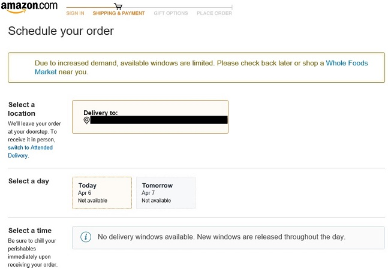

# AmazonScheduleFinder
This is a power shell script to notify you of open schedules for Amazon Whole Food Delivery.  The script will keep trying to find a slot available for delivery every 5 minutes.  Once a schedule is found window will beep (turn your computer sound on!) and you will see a prompt on the console saying: Schedule Found at [Time]

## Requirement:
1. Window Machine
2. You must enable permission to run power shell.  See instruction below
3. This only works after you have already logged into your Amazon account and with everything selected in your cart and you must already see the below screen:

### Instruction to set up Power Shell:
*Use below to assign Execution Policy.  Make sure to run below in separate PowerShell App as Admin*
 - Set-ExecutionPolicy -ExecutionPolicy RemoteSigned -Scope CurrentUser  

**Once you're done with using this script you can revert the policy update**
 - Set-ExecutionPolicy -ExecutionPolicy Undefined -Scope CurrentUser  
